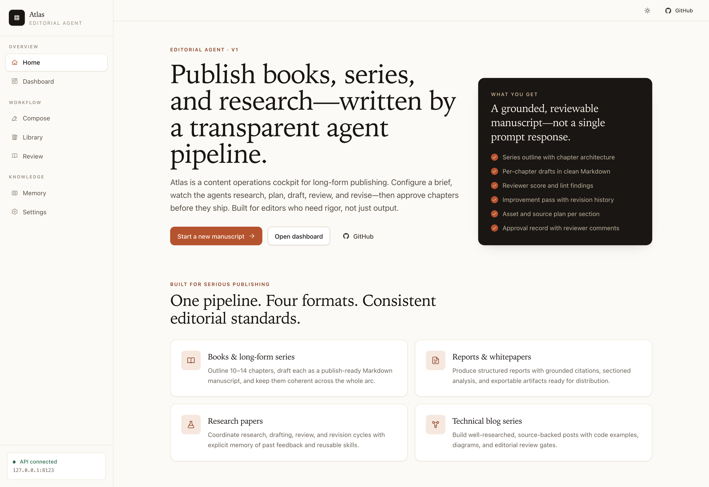
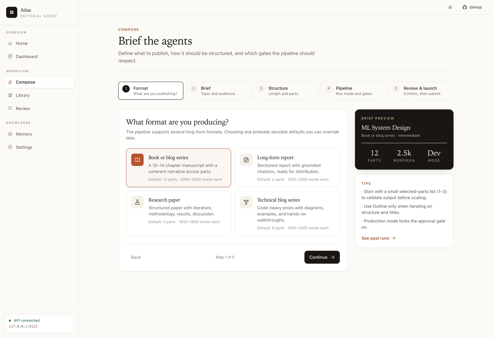
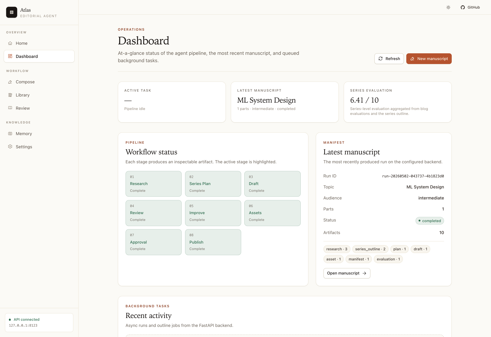
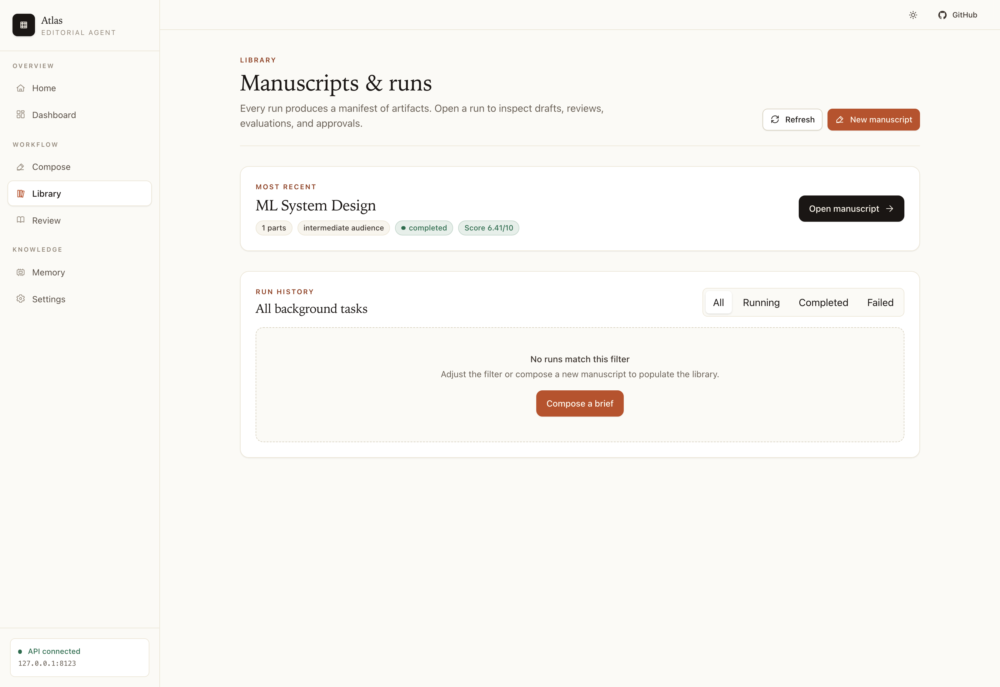
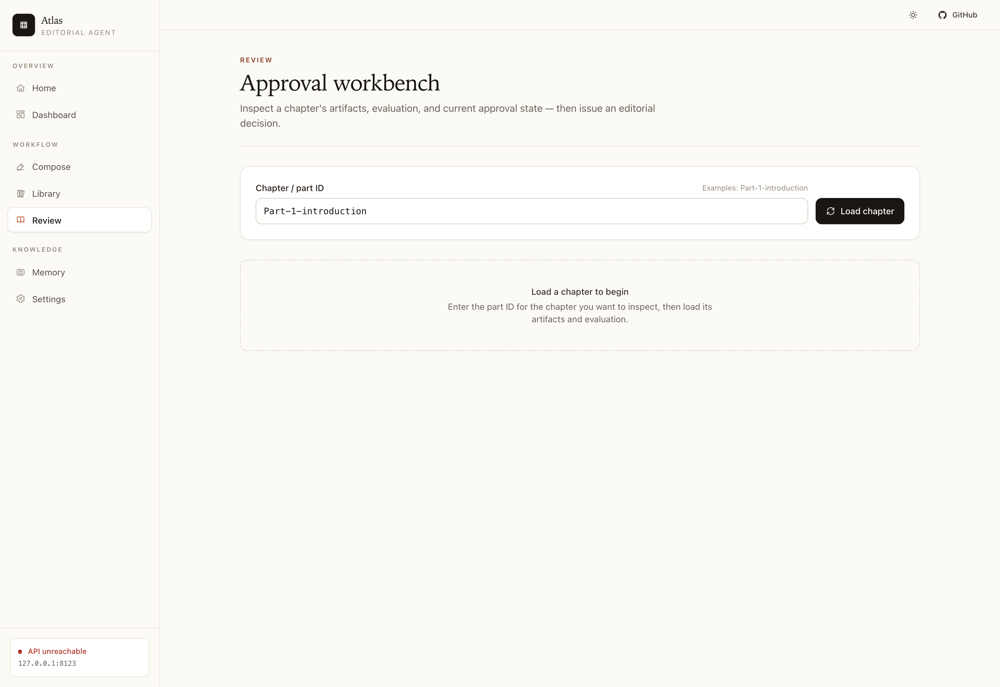
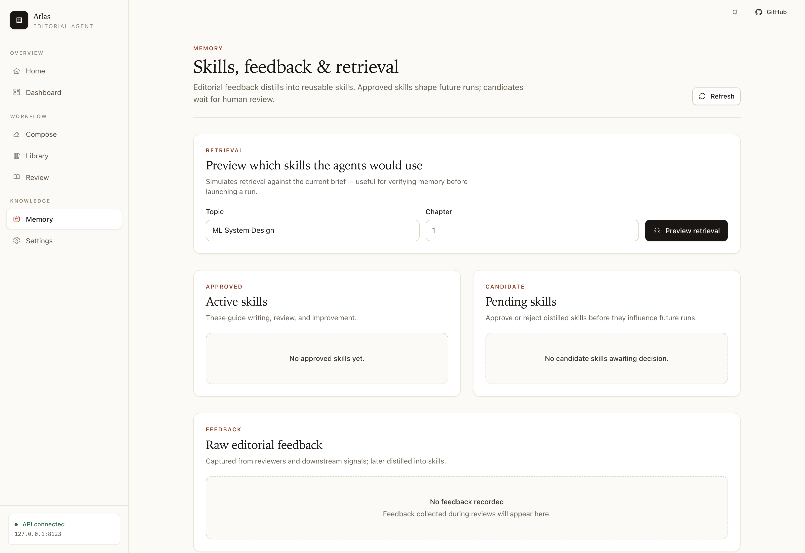
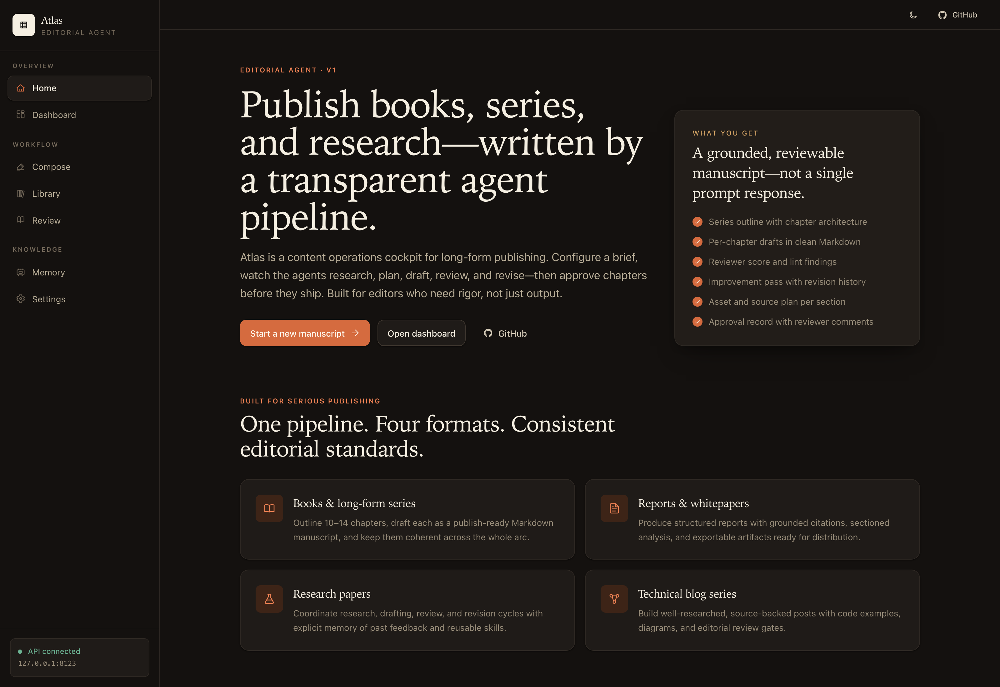

# Atlas — AI Editorial Agent

Production-oriented LangGraph + DeepAgents pipeline for planning, drafting,
reviewing, and approving long-form publishing — books, blog series, reports,
and research papers — with grounded research, automated evaluation, persistent
skill memory, and human approval gates.

- **Live UI:** [ai-agent-blog-generator-app.vercel.app](https://ai-agent-blog-generator-app.vercel.app)
- **Package:** `blog-series-agent`
- **License:** PolyForm Noncommercial 1.0.0 — commercial use requires a separate written license.

## What it does

You give the agents a brief — topic, audience, format, length — and they
produce an inspectable manuscript: outline, per-chapter drafts, lint and
review reports, an improvement pass, asset and source plans, evaluations,
and an approval record. Every artifact is captured to disk for audit and
resumability.

The eight-stage pipeline:

`Research → Series Plan → Draft → Review → Improve → Assets → Approval → Publish`

Run modes (`dev`, `review`, `production`) gate which stages are mandatory and
whether human approval is required before a chapter is publish-ready.

## UI

The Next.js control plane is a multi-page editorial cockpit. Light and dark
themes ship out of the box.

### Home



### Compose wizard

A five-step brief (Format → Brief → Structure → Pipeline → Review) with a
live preview rail.



### Dashboard



### Library, Review, Memory

| Library | Review | Memory |
|---|---|---|
|  |  |  |

### Dark mode

Toggle from the top header bar or the Settings page. Preference persists
per-device and follows `prefers-color-scheme` when set to *System*.



## Quick start

Requirements: Python 3.11+, Node 20+, [`uv`](https://github.com/astral-sh/uv),
and an `OPENAI_API_KEY`.

```bash
# 1. Install backend
uv sync --extra dev
cp .env.example .env   # then edit OPENAI_API_KEY

# 2. Launch the FastAPI backend
uv run blog-series-agent api          # http://127.0.0.1:8000

# 3. Launch the Next.js UI
cd frontend
cp .env.example .env.local            # NEXT_PUBLIC_API_BASE_URL=http://127.0.0.1:8000
npm install
npm run dev                           # http://127.0.0.1:3000
```

Open [http://127.0.0.1:3000](http://127.0.0.1:3000) and walk the **Compose**
wizard to launch your first run.

## CLI

```bash
uv run blog-series-agent --help
```

The most common commands:

| Command | Purpose |
|---|---|
| `outline --topic "..." --audience intermediate --parts 12` | Generate a series outline only. |
| `series --config configs/sample.series.yaml` | Run the full pipeline from a YAML config. |
| `blog --topic "..." --part 1` | Draft a single chapter end-to-end. |
| `review --part-id Part-1-introduction` | Re-run the review pass. |
| `improve --part-id Part-1-introduction` | Apply the improvement pass. |
| `evaluate --part-id Part-1-introduction` | Score a chapter. |
| `evaluate-series` | Score the most recent series. |
| `memory build` | Distil raw feedback into candidate skills. |
| `api` / `dashboard` | Launch FastAPI or Streamlit dashboard. |

Run any command with `--help` for full options.

## Repository layout

```text
src/blog_series_agent/    # All application code
  agents/                 # Topic research, series architect, blog improver, skill extractor
  api/                    # FastAPI app + routes + dependency wiring
  config/                 # Pydantic settings + run-config loader
  dashboard/              # Streamlit dashboard
  deepagent/              # DeepAgents subagent definitions
  graphs/                 # LangGraph outline + blog graphs
  models/                 # LLM factory
  prompts/                # System and tool prompts
  schemas/                # Pydantic schemas (api, memory, run state)
  services/               # Background executor + pipeline orchestration
  utils/                  # Logging, persistence, research helpers
frontend/                 # Next.js 16 + React 19 control plane
  src/app/                # Routes (home, dashboard, compose, library, review, memory, settings)
  src/components/         # Sidebar, topbar, theme toggle, shared UI primitives
  src/lib/                # API client + AppProvider context
  scripts/                # Screenshot capture (playwright)
configs/                  # Sample YAML run configs
docs/                     # Design notes + UI assets
tests/                    # Pytest suite mirroring the package layout
```

## Configuration

All runtime configuration is environment-driven. See `.env.example` for the
canonical list. Most-used:

| Variable | Default | Notes |
|---|---|---|
| `OPENAI_API_KEY` | — | Required. |
| `BLOG_SERIES_MODEL` | `gpt-4o-mini` | Default model. |
| `BLOG_SERIES_OUTPUT_DIR` | `outputs` | Where artifacts and manifests are written. |
| `BLOG_SERIES_USE_MEMORY` | `true` | Apply approved skills during runs. |
| `BLOG_SERIES_ENABLE_WEB_SEARCH` | `false` | Enable grounded web research. |
| `BLOG_SERIES_CORS_ORIGINS` | `*` | FastAPI CORS allowlist. |
| `NEXT_PUBLIC_API_BASE_URL` (frontend) | `http://localhost:8000` | Backend base URL the UI calls. |

The UI also exposes the backend URL on the **Settings** page; the value is
saved to `localStorage` and overrides the build-time default.

## Run modes

| Mode | Review | Approval gate | Use when |
|---|---|---|---|
| `dev` | optional | off | Iterating quickly on prompts and outlines. |
| `review` | enabled | optional | Iterating on chapters with reviewer feedback. |
| `production` | enabled | **required** | Producing publish-ready manuscripts. |

## Testing

```bash
uv run pytest                                # 59 tests
uv run python -m compileall -q src tests     # smoke
cd frontend && npm run lint && npm run build # frontend gate
```

CI mirrors these on every push and PR.

## Screenshots

The README screenshots live in `docs/assets/` and are reproducible via
Playwright:

```bash
# Backend on a free port (anywhere will do)
BLOG_SERIES_CORS_ORIGINS="*" uv run uvicorn blog_series_agent.api.app:app --port 8123 &

# Built UI on a free port
cd frontend && npm run build && PORT=4321 npm run start &

# Capture (writes to ../docs/assets/)
SCREENSHOT_API_BASE=http://127.0.0.1:8123 npm run screenshots
```

## License

Licensed under the PolyForm Noncommercial 1.0.0. See `LICENSE`, `NOTICE`,
`COMMERCIAL.md`, and `LICENSE_POLICY.md`. Commercial use requires a separate
written license — open an issue or contact the maintainers.
