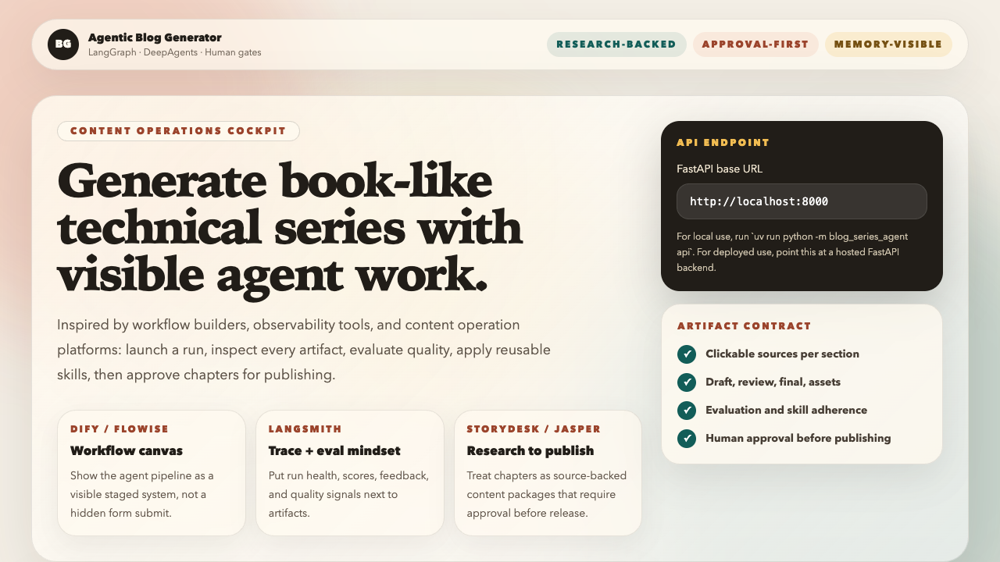
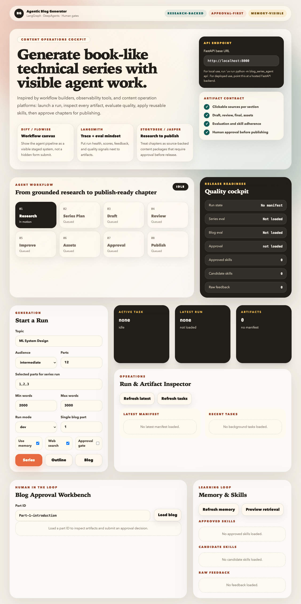

# AI Agent Blog Generator

Production-oriented LangGraph and DeepAgents application for generating grounded,
book-like technical blog series with review, improvement, evaluation, memory, and
human approval gates.

Live UI: [ai-agent-blog-generator-app.vercel.app](https://ai-agent-blog-generator-app.vercel.app)

Package name: `blog-series-agent`

License: PolyForm Noncommercial License 1.0.0. Commercial use requires a separate written license.

AGPL note: this repository intentionally does **not** use AGPL. AGPL is strong
network copyleft, but it still allows commercial use. This project uses PolyForm
Noncommercial because the policy goal is to prohibit commercial usage unless a
separate written commercial license is granted.

## Product Summary

AI Agent Blog Generator is a content operations system for long-form technical
publishing. It takes an input such as:

```yaml
topic: ML System Design
target_audience: intermediate
num_parts: 12
```

and produces a cohesive, chapter-style blog series with:

- a full series outline
- grounded research notes
- one draft Markdown file per blog
- review reports in JSON and Markdown
- improved final Markdown files
- section-level source and asset plans
- blog, series, and run evaluations
- human approval records
- raw feedback logs
- candidate and approved reusable skills
- run manifests for inspection and resumability

The primary use case is generating publishable technical education content for
topics such as ML System Design, AI Agents, RAG, LLM Evaluation, Data
Engineering, and AI infrastructure.

## UI Demo

There is no existing demo video source in this repository, so the README includes
committed UI screenshots captured from the deployed Vercel application. These
assets live under `docs/assets/`.

### Control Plane Overview



The top-level control plane exposes the system as an operator cockpit rather
than a plain form. It shows the FastAPI backend target, the artifact contract,
the current agent workflow, and the release-readiness summary.

### Full Dashboard Walkthrough



The full page supports the normal editorial workflow:

1. Configure the backend API URL.
2. Launch a series, outline-only run, or single-blog run.
3. Track task status and artifact manifests.
4. Inspect draft, review, final, asset, approval, and evaluation artifacts.
5. Submit approval decisions.
6. Browse raw feedback, candidate skills, approved skills, and retrieval previews.

## Production Capabilities

The repository is designed as a real starting point for an agentic publishing
workflow, not a toy demo.

### Generation

- Topic research and series planning.
- Ordered table-of-contents generation for a 10 to 14 part technical series.
- Section-aware chapter planning and writing through DeepAgents.
- Markdown output suitable for Medium-style publishing.
- Configurable target word counts.
- Optional grounded web search and page fetching.

### Review and Improvement

- Structured review scoring across clarity, depth, freshness, structure,
  examples, visuals, practical relevance, and series alignment.
- Deterministic content linting for missing sections, weak references,
  placeholder visuals, missing code examples, and under-target length.
- Improvement pass that receives reviewer feedback, deterministic lint findings,
  approval comments, and retrieved guidance.

### Evaluation

- Blog-level evaluation.
- Series-level evaluation.
- Run-level evaluation.
- Machine-readable and Markdown evaluation artifacts.
- Skill-adherence checks in review and evaluation output.

### Human Approval

- Approval is a release gate, not a memory store.
- Supported statuses are `approved`, `approved_with_notes`,
  `changes_requested`, and `rejected`.
- Approval records include reviewer, comments, timestamp, and linked artifact
  references.
- Production mode can require approval before publish-ready status.

### Memory and Self-Improvement

- Raw feedback is stored separately from approval history.
- Repeated feedback can be distilled into candidate reusable skills.
- Only approved active skills influence future runs.
- Retrieved skills are passed explicitly into writer, reviewer, and improver
  context as visible guidance.
- Reviewer output checks whether active skills were followed or violated.

### Observability

- Structured logs.
- Run manifests.
- Artifact metadata.
- Optional LangSmith trace integration.
- Vercel preview and production deployments for the Next.js UI.

## Architecture

The system uses explicit orchestration rather than hiding generation inside one
large prompt.

```text
User request
  -> Config + service container
  -> LangGraph outline graph
      -> topic research
      -> series architecture
  -> LangGraph blog graph per selected part
      -> retrieve approved skills
      -> DeepAgents content builder
      -> deterministic content lint
      -> reviewer
      -> improver
      -> asset planner
      -> blog evaluation
      -> memory update
      -> human approval gate
  -> series evaluation
  -> run evaluation
  -> manifests + artifacts
```

### Why LangGraph

LangGraph is used where stateful routing matters:

- optional review and improvement stages
- optional evaluation and memory stages
- approval-required production gates
- changes-requested routing back to improvement
- per-part workflow state
- explicit separation between generation, evaluation, approval, and memory

### Why DeepAgents

DeepAgents is used for the content builder because chapter generation needs
filesystem-backed planning, source collection, section drafting, visual planning,
and package-level QA.

Key files:

- `src/blog_series_agent/deepagent/AGENTS.md`
- `src/blog_series_agent/deepagent/subagents.yaml`
- `src/blog_series_agent/deepagent/skills/*/SKILL.md`
- `src/blog_series_agent/services/deepagent_content_builder.py`

The DeepAgents workspace writes:

- `research.md`
- `plan.md`
- `draft.md`
- `assets.md`
- `manifest.json`

Canonical artifacts are then copied into the normal `outputs/` folders so the
API, dashboard, evaluation, memory, and approval layers all see one consistent
artifact contract.

## Repository Layout

```text
.
├── configs/                         YAML run configs
├── docs/                            product, workflow, and operations docs
│   └── assets/                      README screenshots and visual assets
├── frontend/                        Next.js control-plane UI for Vercel
├── outputs/                         generated artifacts, ignored by git
├── src/blog_series_agent/
│   ├── agents/                      prompt-driven agent wrappers
│   ├── api/                         FastAPI application and routes
│   ├── config/                      settings and run config models
│   ├── dashboard/                   Streamlit local dashboard
│   ├── deepagent/                   DeepAgents instructions, skills, subagents
│   ├── graphs/                      LangGraph state, graph builders, routing
│   ├── models/                      OpenAI-compatible model abstraction
│   ├── prompts/                     external prompt templates
│   ├── schemas/                     Pydantic domain and API schemas
│   ├── services/                    pipeline, memory, approval, eval, tracing
│   └── utils/                       logging, files, markdown, slug helpers
├── tests/                           pytest suite with mocks and fakes
├── .env.example
├── LICENSE
├── NOTICE
├── COMMERCIAL.md
├── pyproject.toml
└── README.md
```

## Artifact Contract

Generated output is written to predictable paths under `outputs/`.

```text
outputs/series_outline/series_outline.md
outputs/series_outline/series_outline.json
outputs/research/topic_research.md
outputs/research/Part-1-introduction-research.md
outputs/blog_plans/Part-1-introduction-plan.md
outputs/drafts/Part-1-introduction.md
outputs/reviews/Part-1-introduction-review.json
outputs/reviews/Part-1-introduction-review.md
outputs/final/Part-1-introduction.md
outputs/assets/Part-1-introduction-assets.md
outputs/approval/Part-1-introduction-approval.json
outputs/evaluations/blog/Part-1-introduction-eval.json
outputs/evaluations/series/series-eval.json
outputs/evaluations/runs/run-<id>-eval.json
outputs/manifests/run-<timestamp>-<id>.json
outputs/memory/raw_feedback_log.jsonl
outputs/memory/approved_skills.json
```

Generated outputs are ignored by git. Commit only code, prompts, docs, tests,
and intentional sample assets.

## Quick Start

### Requirements

- Python 3.11+
- `uv`
- Node.js 20+ for the web UI
- OpenAI-compatible API credentials for live generation

### Install Backend

```bash
uv sync --extra dev
cp .env.example .env
```

Set at least:

```bash
OPENAI_API_KEY=...
BLOG_SERIES_MODEL=gpt-5.4-nano
BLOG_SERIES_OUTPUT_DIR=outputs
```

### Generate a Series

```bash
uv run python -m blog_series_agent run \
  --topic "ML System Design" \
  --audience intermediate \
  --parts 12
```

### Generate With Grounded Web Research

```bash
uv run python -m blog_series_agent run \
  --topic "ML System Design" \
  --audience intermediate \
  --parts 12 \
  --web-search
```

### Generate From YAML Config

```bash
uv run python -m blog_series_agent run \
  --topic "ML System Design" \
  --config configs/sample.series.yaml
```

### Launch FastAPI

```bash
uv run python -m blog_series_agent api
```

The default API URL is `http://127.0.0.1:8000`.

### Launch Streamlit Dashboard

```bash
uv run python -m blog_series_agent dashboard
```

### Launch Next.js UI Locally

```bash
cd frontend
npm ci
npm run dev
```

Then open `http://localhost:3000`.

## Configuration

Configuration is available through environment variables and YAML config files.

Key environment variables:

```text
OPENAI_API_KEY
OPENAI_BASE_URL
BLOG_SERIES_MODEL
BLOG_SERIES_TEMPERATURE
BLOG_SERIES_MAX_TOKENS
BLOG_SERIES_OUTPUT_DIR
BLOG_SERIES_LOG_LEVEL
BLOG_SERIES_ENABLE_EVALUATION
BLOG_SERIES_ENABLE_MEMORY
BLOG_SERIES_USE_MEMORY
BLOG_SERIES_MAX_RETRIEVED_SKILLS
BLOG_SERIES_ENABLE_WEB_SEARCH
BLOG_SERIES_WEB_SEARCH_MAX_RESULTS
BLOG_SERIES_WEB_FETCH_MAX_CHARS
BLOG_SERIES_WEB_MAX_FETCHES_PER_SECTION
BLOG_SERIES_ENABLE_LANGSMITH
LANGSMITH_API_KEY
BLOG_SERIES_LANGSMITH_PROJECT
BLOG_SERIES_LANGSMITH_TRACE_PROMPTS
BLOG_SERIES_LANGSMITH_TRACE_ARTIFACTS
BLOG_SERIES_CORS_ORIGINS
```

Example config:

```yaml
topic: ML System Design
target_audience: intermediate
num_parts: 12
output_dir: outputs
selected_parts: [1, 2, 3, 6, 8, 12]
enable_review: true
enable_improve: true
enable_asset_plan: true
enable_human_approval: true
enable_evaluation: true
enable_memory: true
use_memory: true
max_retrieved_skills: 5
min_word_count: 2000
max_word_count: 3000
run_mode: production
approval_required: true
enable_langsmith: false
```

## CLI Reference

Generate the full series:

```bash
uv run python -m blog_series_agent run --topic "ML System Design" --audience intermediate --parts 12
```

Generate only the outline:

```bash
uv run python -m blog_series_agent outline --topic "AI Agents" --audience intermediate --parts 12
```

Generate one blog:

```bash
uv run python -m blog_series_agent write --topic "ML System Design" --part 4 --audience intermediate --parts 12
```

Review an existing draft:

```bash
uv run python -m blog_series_agent review --file outputs/drafts/Part-4-feature-pipelines.md
```

Improve an existing draft:

```bash
uv run python -m blog_series_agent improve \
  --draft outputs/drafts/Part-4-feature-pipelines.md \
  --review outputs/reviews/Part-4-feature-pipelines-review.json
```

Evaluate a blog:

```bash
uv run python -m blog_series_agent evaluate --part 4
```

Evaluate the latest series:

```bash
uv run python -m blog_series_agent evaluate-series
```

Approve a final artifact:

```bash
uv run python -m blog_series_agent approve \
  --part-id Part-4-feature-pipelines \
  --status approved \
  --reviewer editor \
  --comments "Ready to publish."
```

Submit feedback:

```bash
uv run python -m blog_series_agent feedback add \
  --part 4 \
  --type clarity_issue \
  --comment "Lead with the production pain point before definitions."
```

Build candidate skills:

```bash
uv run python -m blog_series_agent memory build --topic "ML System Design" --audience intermediate
```

List memory:

```bash
uv run python -m blog_series_agent memory list
```

Approve or reject a candidate skill:

```bash
uv run python -m blog_series_agent memory approve --skill-id skill-clarity-open-with-problem
uv run python -m blog_series_agent memory reject --skill-id skill-clarity-open-with-problem
```

Preview skill retrieval:

```bash
uv run python -m blog_series_agent memory retrieve --topic "ML System Design" --part 1
```

Resume a run:

```bash
uv run python -m blog_series_agent resume --run-id run-123 --topic "ML System Design" --parts 12
```

## FastAPI Service

Start locally:

```bash
uv run python -m blog_series_agent api
```

Important routes:

| Method | Route | Purpose |
| --- | --- | --- |
| `POST` | `/runs/series` | Trigger a full series run |
| `POST` | `/runs/outline` | Generate only the series outline |
| `POST` | `/runs/blog` | Generate one selected blog |
| `POST` | `/runs/review` | Review a draft |
| `POST` | `/runs/improve` | Improve a draft from review feedback |
| `GET` | `/runs/{run_id}` | Inspect run status |
| `GET` | `/runs/{run_id}/artifacts` | List run artifacts |
| `GET` | `/blogs/{part_id}` | Fetch draft, final, review, eval, approval data |
| `POST` | `/approval/{part_id}` | Submit approval decision |
| `POST` | `/evaluation/blog/{part_id}` | Evaluate one blog |
| `POST` | `/evaluation/series` | Evaluate latest series |
| `POST` | `/feedback` | Add structured feedback |
| `GET` | `/feedback` | List raw feedback |
| `POST` | `/memory/build` | Build candidate reusable skills |
| `GET` | `/memory/raw-feedback` | Inspect raw feedback |
| `GET` | `/memory/skills` | Inspect candidate and approved skills |
| `POST` | `/memory/{skill_id}/approve` | Promote a candidate skill |
| `POST` | `/memory/{skill_id}/reject` | Reject a candidate skill |
| `GET` | `/memory/retrieval-preview` | Preview retrieved guidance |
| `GET` | `/series/latest` | Fetch latest outline and summary |

Example feedback submission:

```bash
curl -X POST http://127.0.0.1:8000/feedback \
  -H "Content-Type: application/json" \
  -d '{
    "part_number": 4,
    "blog_slug": "feature-pipelines",
    "source_artifact": "Part-4-feature-pipelines",
    "raw_feedback": "The article needs a stronger synthesis section.",
    "normalized_issue_type": "clarity_issue",
    "severity": "medium",
    "suggested_fix": "Add a synthesis paragraph after dense enumerations.",
    "reviewer": "editor"
  }'
```

## Next.js Control Plane

The `frontend/` app is the hosted production UI.

It supports:

- editable FastAPI backend URL
- series, outline, and single-blog run launchers
- task polling
- latest manifest inspection
- artifact count summary
- blog artifact loading by part ID
- approval form
- memory and skills browser
- retrieval preview
- quality and release-readiness cards

Run locally:

```bash
cd frontend
npm ci
npm run dev
```

Build locally:

```bash
cd frontend
npm run lint
npm run build
```

Production deployment:

- Vercel project: `ai-agent-blog-generator`
- root directory: `frontend`
- framework: Next.js
- install command: `npm ci`
- build command: `npm run build`
- production branch: `main`
- stable URL: [ai-agent-blog-generator-app.vercel.app](https://ai-agent-blog-generator-app.vercel.app)

Set `NEXT_PUBLIC_API_BASE_URL` in Vercel when a hosted FastAPI backend is
available. For local demos, the UI can point to `http://localhost:8000`.

## Streamlit Dashboard

The Streamlit dashboard is useful for local artifact moderation and debugging.

It supports:

- starting runs
- viewing outlines
- browsing generated blogs
- comparing draft, review, final, and asset outputs
- viewing evaluation scores
- approving, rejecting, or requesting changes
- browsing raw feedback and memory
- approving or rejecting candidate skills

Launch it with:

```bash
uv run python -m blog_series_agent dashboard
```

## Evaluation Architecture

Evaluation is separate from approval and memory.

Schemas include:

- `CriterionScore`
- `BlogEvaluation`
- `SeriesEvaluation`
- `RunEvaluation`
- `EvaluationIssue`
- `EvaluationTrend`
- `RepeatedFailurePattern`
- `ImprovementOpportunity`

Blog evaluation checks:

- structure consistency
- series alignment
- clarity of explanation
- technical accuracy
- technical freshness
- depth and completeness
- readability and tone
- visuals and examples
- engagement and learning reinforcement
- practical relevance
- active skill adherence

Series evaluation checks:

- progression quality
- topic overlap
- continuity between parts
- tone and structure consistency
- coverage gaps

Run evaluation checks:

- number of blogs completed
- average review scores
- approval outcomes
- repeated issue patterns
- retry counts
- human revision load

## Approval History vs Memory

Approval and memory are intentionally separate.

Approval history is release-oriented:

- stored under `outputs/approval/`
- answers whether a specific artifact is publish-ready
- includes reviewer identity, decision, comments, timestamp, and artifact links

Memory is learning-oriented:

- stored under `outputs/memory/`
- improves future generations
- is never treated as approval state
- must remain inspectable and auditable

The system does not merge approval records and learned memory into one store.

## Memory Lifecycle

### Raw Feedback Log

Raw feedback is the source layer for learning:

```text
outputs/memory/raw_feedback_log.jsonl
outputs/memory/raw_feedback_log.md
```

Feedback can come from:

- reviewer outputs
- evaluation issues
- approval comments
- explicit user feedback through CLI, API, or dashboard

Example:

```json
{
  "feedback_id": "fb-1234abcd",
  "source_type": "reviewer",
  "source_artifact": "outputs/reviews/Part-1-introduction-review.md",
  "part_number": 1,
  "blog_slug": "introduction",
  "raw_feedback": "The introduction jumps into definitions before the real-world problem.",
  "normalized_issue_type": "clarity_issue",
  "severity": "medium",
  "suggested_fix": "Open with a concrete real-world problem before definitions.",
  "reviewer": "reviewer-agent"
}
```

### Candidate Skills

Repeated feedback patterns can become candidate reusable skills:

```text
outputs/memory/skill_candidates.json
```

Candidate skills are not active by default.

### Approved Reusable Skills

Only approved, active skills influence future generations:

```text
outputs/memory/approved_skills.json
outputs/memory/approved_skills.md
```

Example:

```json
{
  "id": "skill-clarity-open-with-problem",
  "title": "Lead introductions with a concrete problem",
  "category": "clarity_issue",
  "trigger_conditions": {
    "topic_keywords": ["ml system design"],
    "audience_levels": ["intermediate"],
    "artifact_types": ["draft", "review", "final"],
    "issue_types": ["clarity_issue"]
  },
  "guidance_text": "When opening a chapter, begin with a relatable production problem before defining the concept.",
  "source_feedback_ids": ["fb-1234abcd", "fb-5678efgh"],
  "confidence_score": 0.75,
  "usage_count": 3,
  "status": "approved",
  "active": true
}
```

## Explicit Guidance Retrieval

Memory is retrieved guidance, not hidden prompt mutation.

Before writing, reviewing, and improving a blog, the system retrieves relevant
approved skills based on:

- topic
- audience
- part number
- artifact type
- known issue categories

Retrieved guidance is passed explicitly as named context:

- `retrieved_guidance`
- `active_skills`
- `recent_mistakes`
- `violated_skills`

Example:

```text
Retrieved approved skills:
- [skill-clarity-open-with-problem] Open with a concrete production problem before definitions.
- [skill-series-bridge] Connect each post to the previous and next part in the series.
```

Skill usage is inspectable in manifests, memory retrieval logs, review outputs,
evaluation outputs, API responses, and dashboard views.

## LangSmith Integration

LangSmith is optional. The app runs normally when LangSmith variables are absent.

Enable with:

```text
BLOG_SERIES_ENABLE_LANGSMITH=true
LANGSMITH_API_KEY=...
BLOG_SERIES_LANGSMITH_PROJECT=blog-series-agent
BLOG_SERIES_LANGSMITH_API_KEY_ENV=LANGSMITH_API_KEY
BLOG_SERIES_LANGSMITH_TRACE_PROMPTS=false
BLOG_SERIES_LANGSMITH_TRACE_ARTIFACTS=false
```

The observability layer can log:

- run start and finish events
- node events
- artifact metadata
- evaluation summaries
- feedback events
- skill retrieval metadata
- skill-adherence metadata

## Production Operations

Recommended workflow:

1. Create a short-lived branch from `main`.
2. Make code, prompt, docs, or UI changes.
3. Run backend tests and frontend checks.
4. Push the branch.
5. Open a pull request.
6. Wait for GitHub Actions and Vercel preview to pass.
7. Merge to `main`.
8. Let Vercel deploy production automatically.

Relevant docs:

- `docs/PRODUCTION_OPERATIONS.md`
- `docs/QUICKSTART.md`
- `docs/README-WORKFLOW.md`
- `docs/DOCUMENTATION-INDEX.md`

## Testing

Backend:

```bash
uv run pytest
```

Frontend:

```bash
cd frontend
npm run lint
npm run build
```

The test suite uses mocks and fakes. It does not require live LLM calls.

Coverage areas include:

- schema validation
- prompt loading
- file naming and persistence
- graph routing
- approval persistence
- evaluation parsing and aggregation
- raw feedback logging
- approved skill persistence
- relevant skill retrieval
- reviewer skill-adherence parsing
- CLI smoke tests
- FastAPI smoke tests
- Streamlit utility logic
- grounded research tool tests
- DeepAgents content-builder integration boundaries

## Security and Governance

- API keys come from environment variables, not committed files.
- `.env` and generated `outputs/` are gitignored.
- The UI stores only the configured API base URL in browser local storage.
- LangSmith tracing is opt-in.
- Prompt and artifact tracing can be disabled.
- Approval records are audit artifacts, not reusable memory.
- Only approved skills are used as active reusable guidance.
- The license is noncommercial by default.

## Troubleshooting

### OpenAI billing balance is not changing

Check whether the configured model endpoint is actually being called:

```bash
grep -E "BLOG_SERIES_MODEL|OPENAI_BASE_URL|OPENAI_API_KEY" .env
```

Then run a small outline job and inspect logs:

```bash
uv run python -m blog_series_agent outline --topic "ML System Design" --parts 3
```

If the app is using a fake model, cached artifacts, or a non-OpenAI-compatible
gateway, OpenAI billing may not change.

### Blogs are too short

Increase configured word counts and ensure section-level generation is enabled
through the DeepAgents content builder:

```yaml
min_word_count: 2200
max_word_count: 3200
```

Then run with grounded research:

```bash
uv run python -m blog_series_agent write --topic "ML System Design" --part 1 --web-search
```

### Images or source credits are missing

Use web search and inspect the asset plan:

```bash
uv run python -m blog_series_agent write --topic "ML System Design" --part 1 --web-search
ls outputs/assets
```

The content lint layer should flag placeholder image links, weak references, and
missing image credit links.

### Vercel UI cannot reach the backend

Set `NEXT_PUBLIC_API_BASE_URL` in Vercel or use the editable API URL field in the
UI. For local testing, run:

```bash
uv run python -m blog_series_agent api
```

and point the UI to:

```text
http://localhost:8000
```

## Limitations

- API execution is local-process oriented and is not yet backed by a distributed
  job queue.
- Streamlit is intended for local moderation, not multi-user production hosting.
- Candidate skill extraction is deterministic by default; the LLM extraction
  prompt exists but is not the default production path.
- LangSmith integration logs metadata and summaries but is not a full replay
  system.
- Image handling plans and credits are supported, but direct image ingestion
  depends on source availability and licensing constraints.

## License

This project is licensed under the PolyForm Noncommercial License 1.0.0.

See:

- `LICENSE`
- `NOTICE`
- `COMMERCIAL.md`
- `LICENSE_POLICY.md`

Commercial use is not permitted unless a separate written commercial license is
granted.

AGPL, GPL, MIT, Apache, and BSD-style licenses are not used here because they
permit commercial usage. PolyForm Noncommercial is the controlling public
repository license for noncommercial use.
